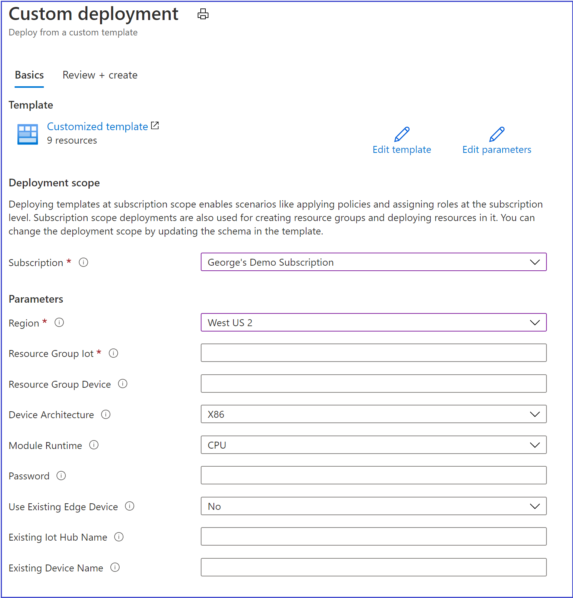

# Open Source People Counting AI Application

Press this button to deploy the people counting application to either the Azure public cloud or your Santa Cruz AI device:

### Overview

This is an open source Santa Cruz AI application providing edge-based people counting with user-defined zone entry/exit events. Video and AI output from the on-prem edge device is egressed to Azure Data Lake, with the user interface running as an Azure Website. AI inferencing is provided by an open source AI model for people detection:

###
This application can execute against a Virtual Azure Eye AI Device in the cloud, or with a physical Santa Cruz AI Devkit.

**Please note: the current implementation runs as emulation in the cloud. A version for the physical Santa Cruz Devkit will be available soon!**
## Software emulation app topology

## Physical hardware app topology

# Installation details
This reference open source application showcases best practices for AI security, privacy and compliance.  It is intended to be immediately useful for anyone to use with their Santa Cruz AI device. Deployment starts with this button:

#

This will redirect you to the Azure portal with this deployment page:

#

To deploy an emulation environment in the cloud, please enter the following parameters:

* __Resource Group IoT__ = Unique name of a new resource group to host your Azure IoT Hub, Data Lake and Web App
* __Resource Group Device__ = Unique name of a new resource group to host the virtualized Santa Cruz AI device. This virtualized device connects to your Data Lake to store the AI and Video output.
* __Device Architecture__ = X86 - Only x86-based devices is supported at this time. ARM64 is coming soon!
* __Module Runtime__ = CPU - Only CPU-based AI inferencing in emulation is supported at this time. Movidius Myriad X is coming soon!
* __Password__ = A password to protect access to the web app which visualizes your output. A best practice is to assign a password to prevent others on the internet from seeing the testing output of your Santa Cruz AI device.

Once deployment is complete, you can launch the web application by navigating to the `Resource Group IoT` name selected above. You will see an Azure Web Services deployment which starts with `ues-eyeapp` followed by 4 random digits. Select this app, then chose the `Browse` button in the top left:

Once the application loads, you will need to enter the password you entered at deployment time. The password is cached for subsequent visits to the same application.

# People Counting in a Zone

You can create a poloygon region in the camera frame to count the number of people in the zone.  Metrics are displayed at the bottom showing total people in the frame vs. people in the zone.  To create a zone, click anywhere on the video window to establish the first corner of your polygon. Clicking 4 times will create a 4-sided polygon. People identified in the zone are shown with a yellow highlight.  Press the `Clear` button in the lower right to clear your zone definition.

#

### Application Installation Permissions
To install this reference application you must have Owner or Contributor level access to the target subscription.  This deployment will create resources within the following Azure namespaces:

* Microsoft.Devices
* Microsoft.Authorization
* Microsoft.ContainerInstance
* Microsoft.ManagedIdentity
* Microsoft.Web
* Microsoft.Compute
* Microsoft.Network
* Microsoft.Storage
* Microsoft.Resources

**Note :** If you want to use Azure Cloud Shell for the deployment, follow the [instructions here](docs/cloudshell-deployment-steps.md)
